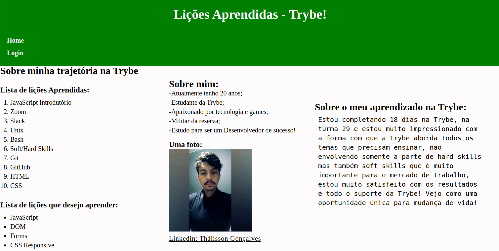

# Foi desenvolvido um site que contém uma série de informações sobre o que aprendi na Trybe ao longo dos últimos três blocos. O site contém elementos posicionados e estilizados, contendo semântica apropriada para que seja acessível e melhor ranqueado.

# Utilizado HTML e CSS.

